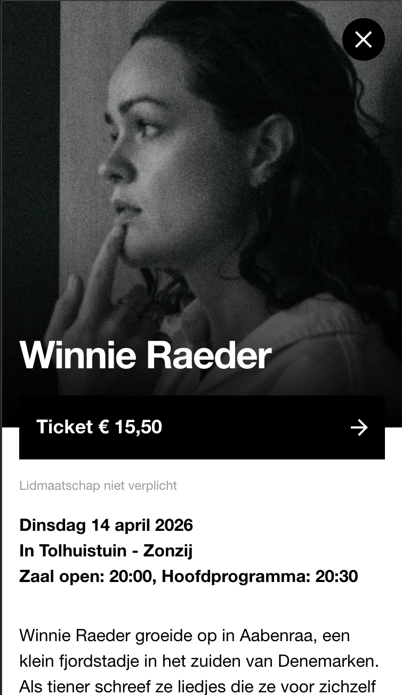
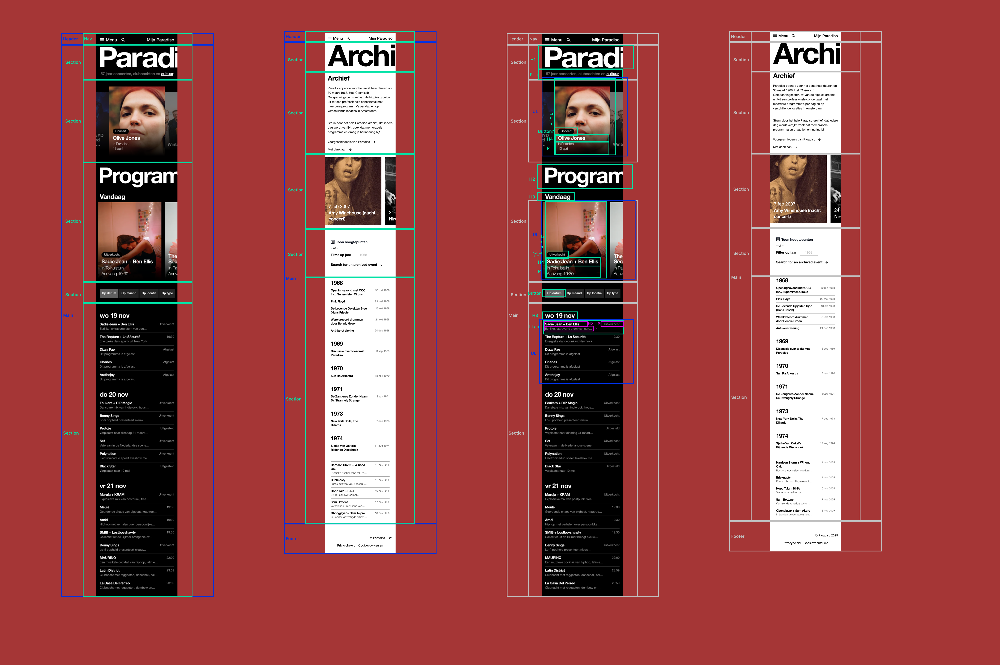
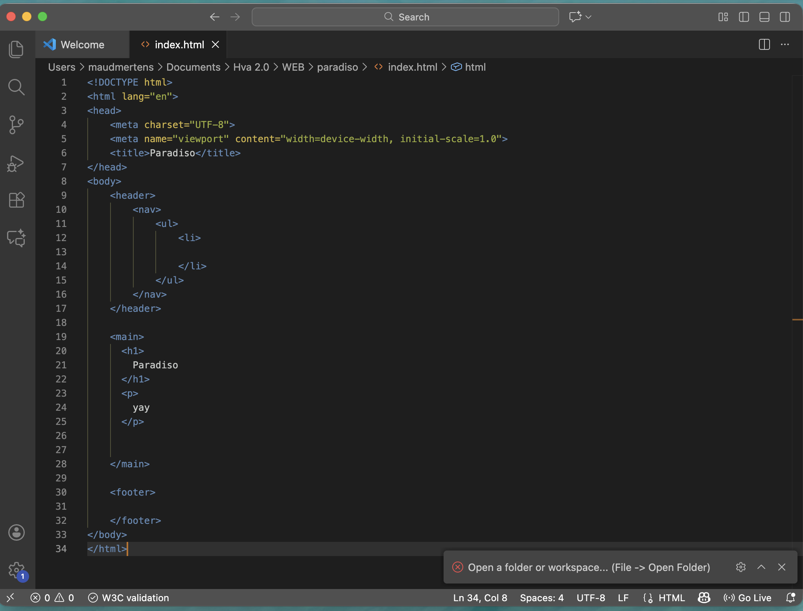

# Procesverslag
Markdown is een simpele manier om HTML te schrijven.  
Markdown cheat cheet: [Hulp bij het schrijven van Markdown](https://github.com/adam-p/markdown-here/wiki/Markdown-Cheatsheet).

Nb. De standaardstructuur en de spartaanse opmaak van de README.md zijn helemaal prima. Het gaat om de inhoud van je procesverslag. Besteedt de tijd voor pracht en praal aan je website.

Nb. Door *open* toe te voegen aan een *details* element kun je deze standaard open zetten. Fijn om dat steeds voor de relevante stuk(ken) te doen.

## Jij

  
uitwerken voor kick-off werkgroep

  ### Auteur:
  Maud Mertens

  #### Je startniveau:
  Blauwe piste 

  #### Je focus:
  Responsive? 
 

## Je website

  
uitwerken voor kick-off werkgroep

  ### Je opdracht:
  https://www.paradiso.nl/

  #### Screenshot(s) van de eerste pagina (small screen): 
  Paradiso - Home page / programma 
  

  #### Screenshot(s) van de tweede pagina (small screen):
  Paradiso - Archief | geweizigd naar: Paradiso - Artiest pagina
  
 

## Toegankelijkheidstest 1/2 (week 1)

  
uitwerken na test in 2e werkgroep

  ### Bevindingen
  Heel leuk extratje met piano geluid als je een pijltje naar boven of beneden drukt met de screenreader. Echt top detail, maar wel een beetje jammer dat het qua voorlezen niet heel soepel verloopt.
  Je ziet in het begin niet duidelijk waar de focus is. Ook zegt de screenreader vanalles wat je niet goed kan volgen. Uiteindelijk na wat door tabben, kan je het wel volgen. Maar de indeling is dus niet ideaal. Er is ook geen "skip to concent" button.

## Breakdownschets (week 1)

  
uitwerken na afloop 3e werkgroep

  ### de hele pagina: 
  

  ### html paradiso: 
  

  <!-- ### wellicht nog een dynamisch deel (bijv filter): 
   -->

## Voortgang 1 (week 2)

  
uitwerken voor 1e voortgang

  ### Stand van zaken
  De website in breakdown maken was wel te doen. Ik was een beetje aan het zoeken, maar snapte over het algmeen wel wat waar stond ongeveer. Dit is natuurlijk niet perfect, en kan wel wat feedback gebruiken.
  Verder was ik met sommige opdrachten aan het struggelen. Ik heb hulp gevraagd aan de student assistent en dat hielp wel. Niet alles volledig af kunnen krijgen, en nog een beetje zoekende in wat ik nodig heb en wil leren, maar ook in het laten liggen en optijd hulp vragen ipv alles alleen uitzoeken.

  ### Agenda voor meeting
  Eerlijk gezegd hebben we niet heel veel samen besproken.
  Het was eerder een wat moet er gebeuren gesprek. We hebben elkaar geholpen met wat duidelijkheid te brengen in wat we af wilde hebben voor de les. Dat was wel hulpzaam voor andere. 

  Alleen Zoë en ik waren in de feedback sessie.
  

  ### Verslag van meeting
  Wij hebben allebei veel feedback gekregen waar we individueel weer mee aan de slag konden.

  - De breakdown schets kan een iets andere verdeling krijgen. Deze verdeling is een stuk logischer en overzichtelijk. Nu kan ik beter de html pagina vorm geven.
  - De pagina's die ik had uitgezocht lijken erg veel op elkaar. Als punt om een "artiesten pagina" te doen ipv de "archief pagina". Ander heb ik 2x het zelfde.
  - Alle linkjes kunnen linken naar de "andere pagina" 
  - Verder goed opweg en alle feedback was duidelijk en hulpzaam om te verwerken.
  - nog een punt voor mij was om met andere samen te gaan zitten en te werken. Zodat ik hulp kan vragen wanneer nodig. En om elkaar te motiveren.

## Voortgang 2 (week 3)

  
uitwerken voor 2e voortgang

  ### Stand van zaken
  De rode piste opdrachten zijn prima te doen, na even zoeken. De zwarte krijg ik error van, dus die sla ik over. Ik merk dat ik nog een beetje grip en duidelijkheid nodig heb, vandaar dat de blauwe en rode goed te doen zijn. Zwart wil ik wel proberen, maar met tijdsdruk vind ik dat niet fijn. Misschien wanneer ik het echt nodig ga hebben met de website. 
  Verder heb ik de webpagina's allebij al grof ingevuld. Nog video en fotos toeveogen, maar de tekst staat. Ik twijfel een beetje over de indeling van de 2e pagina dus hier wil ik ook feedback op vragen.

  ### Agenda voor meeting
  samen met je groepje opstellen

  | Maud              | student 2          | student 3    | student 4        |
  | ---               | ---                | ---          | ---              |
  | Structuur pagina  | en dit             | en ik dit    | en dan ik dat    |
  | Foto slider       | dit als er tijd is | nog een punt | dit wil ik zeker |
  | Wss nog wel iets  |  ...               | ...          | ...              |

  ### Verslag van meeting
  hier na afloop snel de uitkomsten van de meeting vastleggen

  - punt 1
  - punt 2
  - nog een punt
- ...

## Toegankelijkheidstest 2/2 (week 4)

  
uitwerken na test in 9e werkgroep

  ### Bevindingen
  Lijst met je bevindingen die in de test naar voren kwamen (geef ook aan wat er verbeterd is):

## Voortgang 3 (week 4)

  
uitwerken voor 3e voortgang

  ### Stand van zaken
  hier dit ging goed & dit was lastig (neem ook screenshots op van delen van je website en code)

  ### Agenda voor meeting
  samen met je groepje opstellen

  | student 1      | student 2          | student 3    | student 4        |
  | ---            | ---                | ---          | ---              |
  | dit bespreken  | en dit             | en ik dit    | en dan ik dat    |
  | en dat ook nog | dit als er tijd is | nog een punt | dit wil ik zeker |
  | ...            | ...                | ...          | ...              |

  ### Verslag van meeting
  hier na afloop snel de uitkomsten van de meeting vastleggen

  - punt 1
  - punt 2
  - nog een punt
  - ...

## Eindgesprek (week 5)

  
uitwerken voor eindgesprek

  ### Je uitkomst - karakteristiek screenshots:
  

  ### Dit ging goed/Heb ik geleerd: 
  Korte omschrijving met plaatjes

  

  ### Dit was lastig/Is niet gelukt:
  Korte omschrijving met plaatjes

  

## Bronnenlijst

  
continu bijhouden terwijl je werkt

  Nb. Wees specifiek ('css-tricks' als bron is bijv. niet specifiek genoeg). 
  Nb. ChatGpT en andere AI horen er ook bij.
  Nb. Vermeld de bronnen ook in je code.

  1. bron 1
  2. bron 2
  3. ...

