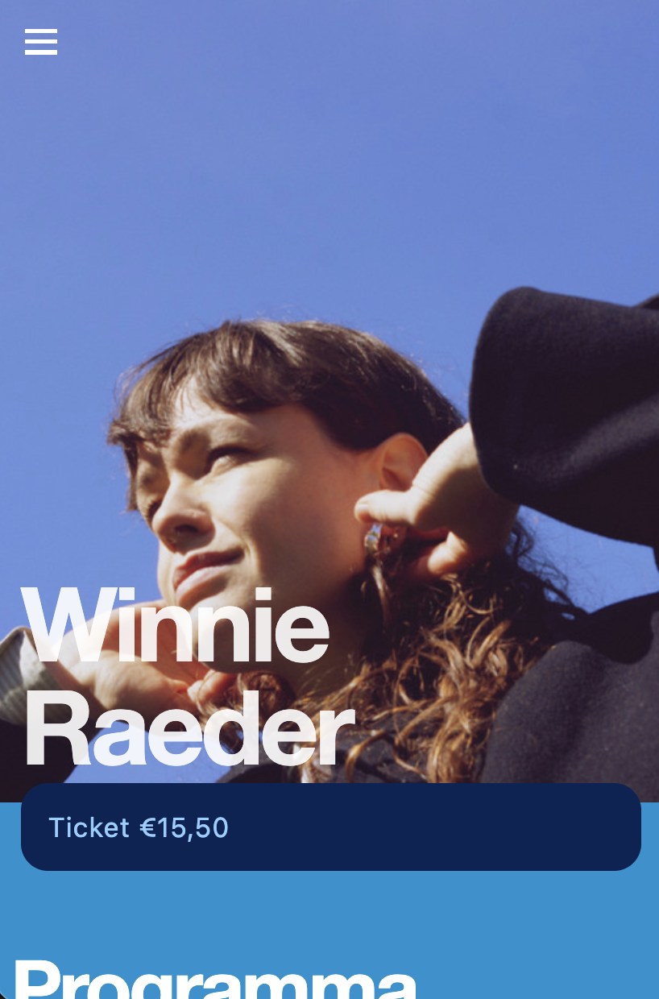
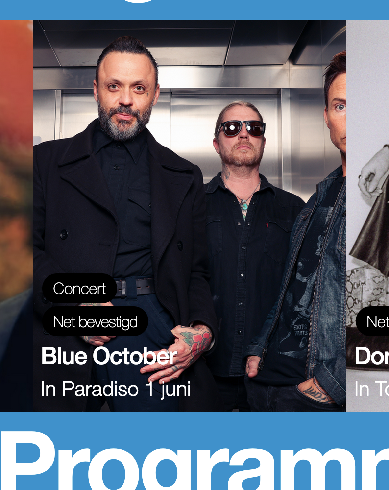
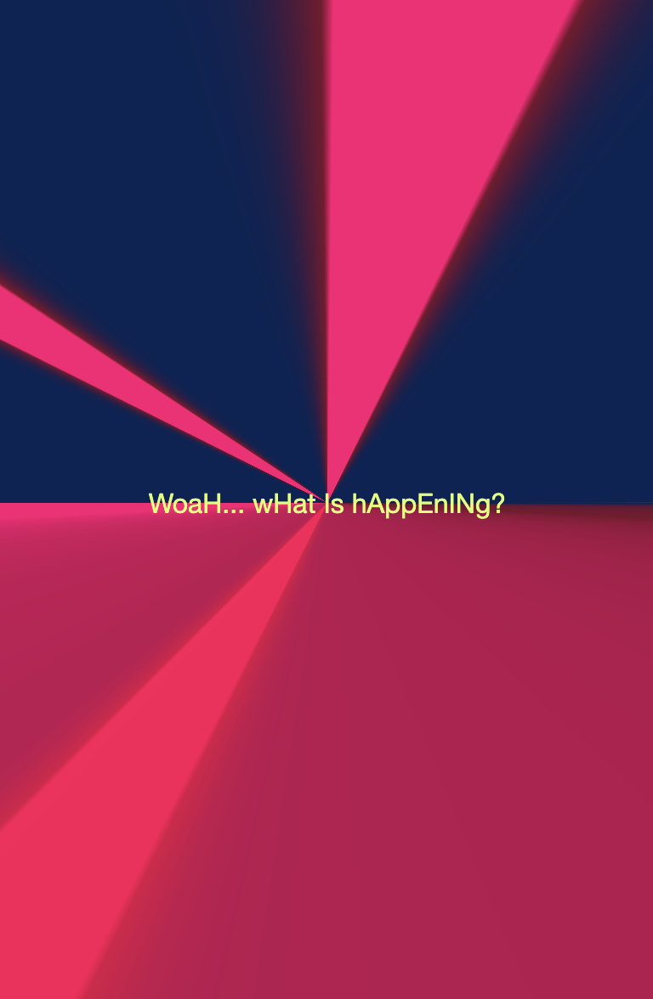
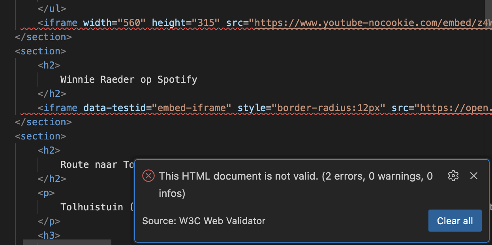
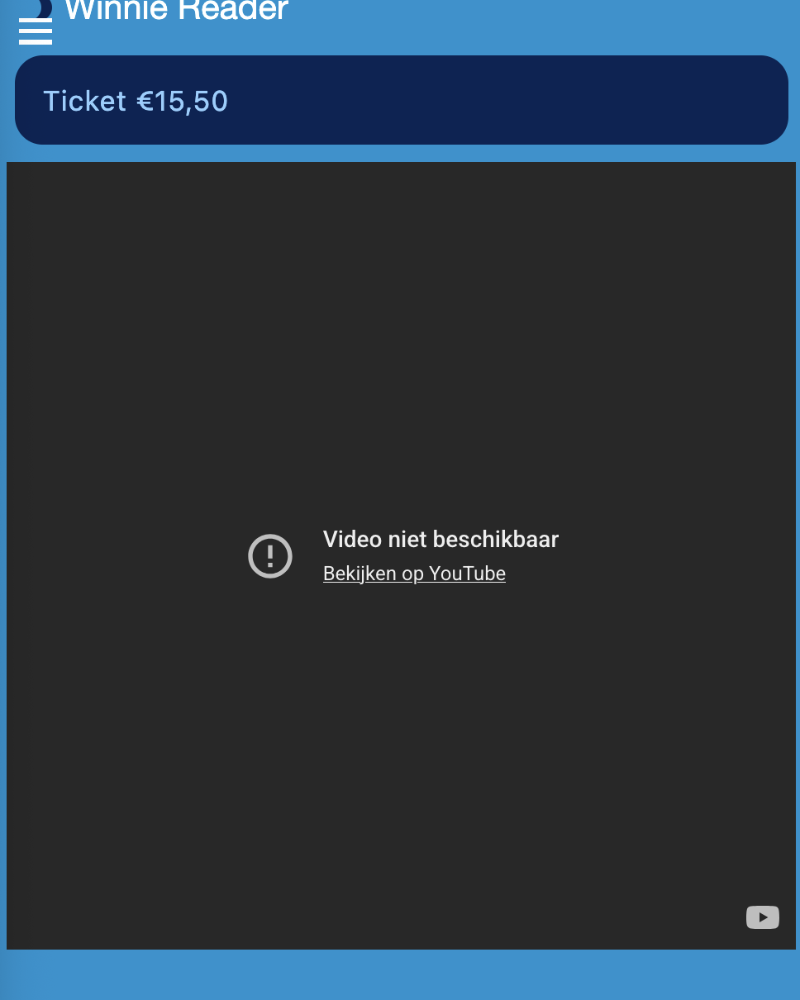

# Procesverslag
Markdown is een simpele manier om HTML te schrijven.  
Markdown cheat cheet: [Hulp bij het schrijven van Markdown](https://github.com/adam-p/markdown-here/wiki/Markdown-Cheatsheet).

Nb. De standaardstructuur en de spartaanse opmaak van de README.md zijn helemaal prima. Het gaat om de inhoud van je procesverslag. Besteedt de tijd voor pracht en praal aan je website.

Nb. Door *open* toe te voegen aan een *details* element kun je deze standaard open zetten. Fijn om dat steeds voor de relevante stuk(ken) te doen.

## Jij

  
uitwerken voor kick-off werkgroep

  ### Auteur:
  Maud Mertens

  #### Je startniveau:
  Blauwe piste 

  #### Je focus:
  Surfice plane
 

## Je website

  
uitwerken voor kick-off werkgroep

  ### Je opdracht:
  https://www.paradiso.nl/

  #### Screenshot(s) van de eerste pagina (small screen): 
  Paradiso - Home page / programma 
  

  #### Screenshot(s) van de tweede pagina (small screen):
  Paradiso - Archief | geweizigd naar: Paradiso - Artiest pagina
  
 

## Toegankelijkheidstest 1/2 (week 1)

  
uitwerken na test in 2e werkgroep

  ### Bevindingen
  Heel leuk extratje met piano geluid als je een pijltje naar boven of beneden drukt met de screenreader. Echt top detail, maar wel een beetje jammer dat het qua voorlezen niet heel soepel verloopt.
  Je ziet in het begin niet duidelijk waar de focus is. Ook zegt de screenreader vanalles wat je niet goed kan volgen. Uiteindelijk na wat door tabben, kan je het wel volgen. Maar de indeling is dus niet ideaal. Er is ook geen "skip to concent" button.

## Breakdownschets (week 1)

  
uitwerken na afloop 3e werkgroep

  ### de hele pagina: 
  

  ### html paradiso: 
  

  <!-- ### wellicht nog een dynamisch deel (bijv filter): 
   -->

## Voortgang 1 (week 2)

  
uitwerken voor 1e voortgang

  ### Stand van zaken
  De website in breakdown maken was wel te doen. Ik was een beetje aan het zoeken, maar snapte over het algmeen wel wat waar stond ongeveer. Dit is natuurlijk niet perfect, en kan wel wat feedback gebruiken.
  Verder was ik met sommige opdrachten aan het struggelen. Ik heb hulp gevraagd aan de student assistent en dat hielp wel. Niet alles volledig af kunnen krijgen, en nog een beetje zoekende in wat ik nodig heb en wil leren, maar ook in het laten liggen en optijd hulp vragen ipv alles alleen uitzoeken.

  ### Agenda voor meeting
  Eerlijk gezegd hebben we niet heel veel samen besproken.
  Het was eerder een wat moet er gebeuren gesprek. We hebben elkaar geholpen met wat duidelijkheid te brengen in wat we af wilde hebben voor de les. Dat was wel hulpzaam voor andere. 

  Alleen Zoë en ik waren in de feedback sessie.
  

  ### Verslag van meeting
  Wij hebben allebei veel feedback gekregen waar we individueel weer mee aan de slag konden.

  - De breakdown schets kan een iets andere verdeling krijgen. Deze verdeling is een stuk logischer en overzichtelijk. Nu kan ik beter de html pagina vorm geven.
  - De pagina's die ik had uitgezocht lijken erg veel op elkaar. Als punt om een "artiesten pagina" te doen ipv de "archief pagina". Ander heb ik 2x het zelfde.
  - Alle linkjes kunnen linken naar de "andere pagina" 
  - Verder goed opweg en alle feedback was duidelijk en hulpzaam om te verwerken.
  - nog een punt voor mij was om met andere samen te gaan zitten en te werken. Zodat ik hulp kan vragen wanneer nodig. En om elkaar te motiveren.

## Voortgang 2 (week 3)

  
uitwerken voor 2e voortgang

  ### Stand van zaken
  De rode piste opdrachten zijn prima te doen, na even zoeken. De zwarte krijg ik error van, dus die sla ik over. Ik merk dat ik nog een beetje grip en duidelijkheid nodig heb, vandaar dat de blauwe en rode goed te doen zijn. Zwart wil ik wel proberen, maar met tijdsdruk vind ik dat niet fijn. Misschien wanneer ik het echt nodig ga hebben met de website. 
  Verder heb ik de webpagina's allebij al grof ingevuld. Nog video en fotos toeveogen, maar de tekst staat. Ik twijfel een beetje over de indeling van de 2e pagina dus hier wil ik ook feedback op vragen.

  ### Agenda voor meeting
  samen met je groepje opstellen

  | Maud              
  | ---               
  | Structuur pagina 
  | Foto slider       
  | Wss nog wel iets  

  ### Verslag van meeting
  hier na afloop snel de uitkomsten van de meeting vastleggen

 De studen assistenten hebben me geod kunnen helpen. De structuur van mijn pagina was oke, een paar kleine aanpassingen om het beter te maken. Ook meto elke section een h hebben, dat wist ik niet.
 Verder nog vragen kunnen stellen over de slider en met hulp van David is dit ook gelukt uiteindelijk.

## Toegankelijkheidstest 2/2 (week 4)

  
uitwerken na test in 9e werkgroep

  ### Bevindingen
  Lijst met je bevindingen die in de test naar voren kwamen (geef ook aan wat er verbeterd is):

  Ik kwam er tijdens de test achter dat een paar dingen nog niet helemaal top waren. Zoals de focus. die was er wel, maar nog niet mooi gestyled. 
  Ik heb met de toegankelijkheid expres gewacht tot het einde. Zo weet ik in ieder geval dat de stuctuur goed is, en kan ik me daarna op deze details gaan focussen.

  Aan de hand van de WCAG lijst, ben ik stap voor stap gaan kijken of het in mijn website zit, zo niet, heb ik het er in toegevoegd. Op een paar na, die me niet lukte.

  Het is veel beter toegankelijk dan de originele website. Vooral de de fucus, skip to content link, en dark-mode. Ook animaties kunnen uit als je hier gevoelig voor bent.

## Voortgang 3 (week 4)

  
uitwerken voor 3e voortgang

  ### Stand van zaken
  Again, met de studenten willen overleggen over de voortgang, maar niemand deelde zijn werk.

  ### Agenda voor meeting
 
 Ik heb wat vragen over de button.
 en over een indeling met img
 en een animatie als daar tijd voor is

 

  ### Verslag van meeting
  hier na afloop snel de uitkomsten van de meeting vastleggen

  Met alles ben ik een stuk verder gekomen door de hulp die ik kreeg. Het was duidelijk en alles is gelukt. De button was even een ding. We kregen m allebij niet op de jusite plek, maar uiteindelijk wel.
  De basic uitleg van een animatie toevoegen was ook duidelijk
  en de afmeting van bepaalde img is ook gelukt.

## Eindgesprek (week 5)

  
uitwerken voor eindgesprek

  ### Je uitkomst - karakteristiek screenshots:
  

  ### Dit ging goed/Heb ik geleerd: 
  Wat heb ik niet geleerd?
  Ik heb heeel veel geleerd met het maken van deze website. Vaak vasgelopen met vanalles en nogwat, maar door elke keer hulp te vragen en de oefeningen te doen op dlo kwam ik er achter hoe het werkte en kon ik dat weer meenemen in mijn site.
  Annimaties heb ik geleerd. (zie de coole extra pagina :P)
  Grid, wat heel nice is.
  de @media, mega chill met de variables
  en hoe je goed dingen kan selecteren in de css
  Slideshow

  Ik ben erg tevreden met wat ik heb gemaakt en merk ook door het te blijven doen en dingen op te zoeken of te vragen in de les, dat ik het steeds meer ging begrijpen en uiteindelijk een stuk gemakkelijker er door heen kon tegen t einde aan. Meer wetende wat ik kan doen om iets aan te passen.

  
  

  ### Dit was lastig/Is niet gelukt:
  Ik vond vooral de slideshow moeilijk en bepaalde positioneringen. Zoals de button in het midden plaatsen.
  Ook had ik de link in de button gezet, maar hier kreeg ik een foutmelding van in de check. Dus heb die er uitgehaald, maar weet nu nog niet hoe ik een button kan linken aan een andere pagina.
  Dit soort dingen zijn vaak voor gekomen, maar uiteindelijk valt het kwartje door uitleg of goede voorbeelden opzoeken en dan onthoud ik het voor een andere keer ook weer.
  Ook greeg ik de video er niet in. Ik had er een gedownload, omdat ik dacht dat dat beter was dan koppelen aan youtube. Maar dat bestand was te groot om op github te plaasten. Dus heb het nog via youtube gedaan. Alleen ik kon de video van Winnie Raeder op een of andere manier niet laten afspelen in mijn site. Dus heb ik een video van een andere artiest er in gezet.

  Uiteindelijk heb ik het met iframe gedaan. Alleen de validator geeft een error. En er wordt css gebruikt in die code. Ik weet dus niet zo goed of dit erg is of niet. Maar omdat dat de enige manier was om het er in te zetten, voor hoe ver ik het weet, heb ik het er wel in laten staan.

  
  

## Bronnenlijst

  
continu bijhouden terwijl je werkt

  Nb. Wees specifiek ('css-tricks' als bron is bijv. niet specifiek genoeg). 
  Nb. ChatGpT en andere AI horen er ook bij.
  Nb. Vermeld de bronnen ook in je code.

/* bron olive jones afbeelding
https://www.google.com/url?sa=i&url=https%3A%2F%2Fearthackney.co.uk%2Fevents%2Folive-jones-23rd-apr-earth-london-tickets-7ded29%2F&psig=AOvVaw3zFBoLfg3TSKLb5yL9rORe&ust=1764574450579000&source=images&cd=vfe&opi=89978449&ved=0CBgQjhxqFwoTCICxppyumZEDFQAAAAAdAAAAABAE */

/* bron blue october afbeelding
https://www.google.com/url?sa=i&url=https%3A%2F%2Fwww.spokesman.com%2Fstories%2F2023%2Fnov%2F14%2Fblue-october-will-spin-the-truth-around-at-a-sold-%2F&psig=AOvVaw0--ZAY5JeX0BkSN5CTM1zM&ust=1764574612624000&source=images&cd=vfe&opi=89978449&ved=0CBgQjhxqFwoTCLjjlfKumZEDFQAAAAAdAAAAABAz */

/* bron don melodie club afbeelding
https://www.google.com/url?sa=i&url=https%3A%2F%2Fpinguinradio.com%2Fmagazine%2Fdon-melody-club-psychonauten%2F&psig=AOvVaw2hVgAHXi5yhAhs9PvRjFrr&ust=1764574766647000&source=images&cd=vfe&opi=89978449&ved=0CBgQjhxqFwoTCJiqqLSvmZEDFQAAAAAdAAAAABAo */

/* bron wintersleep afbeelding
https://www.google.com/url?sa=i&url=https%3A%2F%2Fwww.concertarchives.org%2Fbands%2Fwintersleep&psig=AOvVaw0oBUB5_klVt8t07l3DSRds&ust=1764574846090000&source=images&cd=vfe&opi=89978449&ved=0CBgQjhxqFwoTCNDCidqvmZEDFQAAAAAdAAAAABBG */

/* bron winnie raeder afbeelding
https://www.google.com/url?sa=i&url=https%3A%2F%2Fopen.spotify.com%2Fintl-de%2Fartist%2F1QnifH4HAt0yWP9A9IcoMK&psig=AOvVaw1I_DfefzL7bg2RdqsNY0LD&ust=1764574932398000&source=images&cd=vfe&opi=89978449&ved=0CBgQjhxqFwoTCJiH5JOwmZEDFQAAAAAdAAAAABAl */

/* bron dj alchemist
https://www.google.com/url?sa=i&url=https%3A%2F%2Fwww.rotown.nl%2Fagenda%2Fdj-premier-x-the-alchemist%2F&psig=AOvVaw2b-qUqrD9dkf8lJqM2FkYX&ust=1764863550494000&source=images&cd=vfe&opi=89978449&ved=0CBgQjhxqFwoTCMiPhp_joZEDFQAAAAAdAAAAABAE */

/* bron sadie jane
/* https://www.google.com/url?sa=i&url=https%3A%2F%2Fm.regioactive.de%2Fkonzert%2Fsadie-jean-early-twenties-tourture-berlin-kesselhaus-maschinenhaus-kulturbrauerei-2025-11-10-tickets-R2sgg4nCxq&psig=AOvVaw3T8wchWfFtrGoGKsuKSwSg&ust=1764864523156000&source=images&cd=vfe&opi=89978449&ved=0CBgQjhxqFwoTCIDGzermoZEDFQAAAAAdAAAAABAL */

/* bron opdracht hamburger menu dlo & fixed menu button */
/* https://codepen.io/shooft/pen/JjQLVeB?editors=0010 */
/* ... */

/* easing functions
https://css-tricks.com/ease-out-in-ease-in-out/ */

/* David heeft veel geholpen ook met code uitleggen en dingen werkend te maken */

/* cubic-bezier bron
https://cubic-bezier.com/#0,.47,1,.51 */

/* ook met Ceren samen naar wat opdrachten gekeken en deze gemaakt

Veel inspiratie gehaald uit de opdrachten van dlo */

/* video olive jones youtube
https://www.youtube.com/watch?v=z4WuAHhoylo&list=RDz4WuAHhoylo&start_radio=1 */

/* Video Winnie Raeder
https://www.youtube.com/watch?v=JJIlLeqShWo&list=RDJJIlLeqShWo&start_radio=1 */
/* https://developer.mozilla.org/en-US/docs/Web/HTML/Reference/Elements/video */
/* https://www.clipto.com/nl/media-downloader/youtube-downloader */

/* Spotify code gokopieerd en geplakt vanuit spotify -> als tip gekregen van studenyt assistente */

/* googlemaps 
https://www.google.com/maps/place/Tolhuistuin/@52.3830489,4.901418,17z/data=!4m6!3m5!1s0x47c609b391ad6ae3:0x2591225d95fe66c1!8m2!3d52.3831832!4d4.9032097!16s%2Fg%2F11b6cwgjvy?entry=ttu&g_ep=EgoyMDI1MTIwMi4wIKXMDSoASAFQAw%3D%3D */

/* bron icon reload
https://www.flaticon.com/search?word=arrow%20refresh */

/* bron icon arrow
https://www.flaticon.com/free-icons/arrow/2 */

/* bron om de reload te laten blijven draaien
https://codepen.io/kmathmann/pen/RaGqRr */

/* laser code (gewoon omdat t kan :))
https://www.prowaretech.com/articles/current/css/loading-page-laser-lights#! */

/* skip to content bron
https://www.makethingsaccessible.com/guides/creating-a-skip-to-content-link/ */

/* dark mode 
https://stuffandnonsense.co.uk/blog/redesigning-your-product-and-website-for-dark-mode */

/* bron title in iframe
https://it.sonoma.edu/kb/website-support/siteimprove-how-fix-inline-frame-without-text-alternative */

/* bron to reduce motion
https://stackoverflow.com/questions/58931615/disable-animation-with-prefers-reduced-motion */
/* https://github.com/jensimmons/cssremedy/issues/11 */

